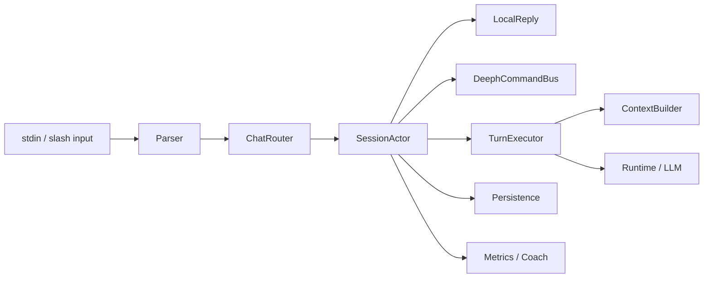

# Arquitetura alvo do `deepH chat`

Objetivo: evoluir o chat CLI para um padrao "Codex-level" sem perder leveza, baixo uso de token e a regra de execucao restrita a comandos `deeph`.

## Invariantes que nao podem quebrar

- O chat pode executar apenas comandos `deeph`.
- `/exec` continua exigindo confirmacao para comandos mutaveis.
- `/help`, `/history`, `/trace`, `/exec` e `/exit` continuam existindo.
- `guide` continua podendo responder localmente sem chamar LLM.
- Sessoes continuam persistidas em `sessions/*.jsonl` e `sessions/*.meta.json`.
- O runtime continua sendo o executor real de agents, skills, channels e budgets.
- Nao introduzir shell generico, vector DB, indexacao pesada ou replay total do historico.

## Estado atual validado no codigo

- O chat central vive em `cmd/deeph/chat_session.go`.
- O `/exec` resolve apenas comandos conhecidos via `commanddoc` e despacha internamente com `run(req.Args)`.
- O `guide` ja tem um roteador local para fluxos operacionais em `cmd/deeph/chat_local_guide.go` e `cmd/deeph/chat_operator.go`.
- O historico atual e serializado como bloco `[chat_session]` com cauda de turns crus.
- O runtime ja possui:
  - `ContextBus`
  - `ContextDirtyFlags`
  - budgets de contexto
  - channels tipados
  - metricas de itens descartados
  - loop de tools para DeepSeek

## Problema central do desenho atual

O chat hoje mistura:

- objetivo atual do usuario
- historico cru da conversa
- dicas operacionais
- estado de execucao
- memoria util da sessao

tudo no mesmo bloco textual enviado ao agent.

Isso e simples, mas cria tres efeitos ruins:

1. o "goal" fica poluido com transcript
2. a janela cresce mais rapido do que deveria
3. o agente recebe ruido em vez de working set

## Principios da arquitetura alvo

### 1. Local-first

Tudo que for deterministico deve ser resolvido antes de chamar LLM:

- slash commands
- comandos `deeph`
- guias operacionais do workspace
- probes locais de estado
- confirmacoes de execucao

### 2. `deeph`-only command bus

Execucao dentro do chat vira um barramento tipado de comandos `deeph`, nunca shell generico.

### 3. Memoria tipada e compacta

O chat deixa de depender de transcript bruto longo e passa a montar contexto por blocos pequenos:

- goal atual
- estado operacional
- decisoes recentes
- perguntas em aberto
- ultimos 1-2 turns crus

### 4. Concorrencia controlada

Go channels e goroutines entram para isolamento de responsabilidades, nao para criar fan-out pesado.

### 5. Recompilacao incremental

Bitmasks de dirty state definem o que precisa ser recompilado no contexto da sessao.

### 6. Observabilidade barata

Cada turno mede roteamento local, uso de LLM, custo de contexto, execucao de comando e descarte de memoria.

## Arquitetura alvo



## Modulos propostos

### 1. `ChatRouter`

Responsavel por classificar o turno:

- `slash_command`
- `pending_exec_reply`
- `local_operational`
- `deeph_command_request`
- `agent_turn`

Regras:

- se o caso for deterministico, nao chama LLM
- se houver comando executavel, produz `CommandProposal`
- se for conversa real, encaminha para `TurnExecutor`

### 2. `SessionActor`

Cada sessao de chat vira um actor leve, com uma goroutine principal e canais internos.

Responsabilidades:

- manter estado da sessao em memoria
- serializar mutacoes da sessao
- garantir ordem de persistencia
- coordenar cancelamento de turnos
- evitar race entre `/exec`, resposta local e LLM

Propriedade importante:

- uma sessao processa um turno ativo por vez
- probes locais podem ocorrer em paralelo, mas sob controle do actor

### 3. `DeephCommandBus`

Camada tipada para comandos executados no chat.

Estrutura sugerida:

```go
type DeephCommand struct {
    Path          string
    Args          []string
    Display       string
    Workspace     string
    NeedsConfirm  bool
    MutatesState  bool
}
```

Regras:

- aceitar apenas paths existentes no `commanddoc`
- continuar bloqueando `chat`, `studio` e `update` de dentro do chat
- normalizar `--workspace`
- manter sugestao de proximo passo
- registrar recibo estruturado da execucao

### 4. `ChatMemoryStore`

Estado compacto da sessao, separado do transcript JSONL.

Estrutura sugerida:

```go
type ChatSessionState struct {
    SessionID         string
    AgentSpec         string
    Goal              string
    OpenQuestions     []string
    RecentDecisions   []string
    ActiveCommands    []DeephCommand
    LastCommandPath   string
    PendingExec       *DeephCommand
    ActiveArtifacts   []string
    LastReplies       []string
    Dirty             ChatDirtyFlags
    ContextVersion    uint64
}
```

Esse estado nao substitui o JSONL. Ele complementa o historico para evitar replay inutil.

### 5. `TurnExecutor`

Camada que monta o contexto de um turno e decide se usa:

- resposta local
- runtime normal
- runtime com tools

Responsabilidades:

- construir working set
- injetar cauda curta de conversa
- acionar o `ContextBus`
- atualizar memoria apos a resposta

### 6. `ChatMetrics`

Metricas por turno:

- `router_local_hit`
- `router_llm_fallback`
- `command_proposed`
- `command_executed`
- `command_confirm_denied`
- `context_tokens`
- `context_dropped`
- `session_resume_used`
- `turn_cancelled`

## Concorrencia proposta

### Sessao

Um actor por sessao:

```go
type SessionActor struct {
    inbound   chan ChatEvent
    outbound  chan ChatReply
    persistCh chan PersistEvent
    metricCh  chan MetricEvent
    cancel    context.CancelFunc
}
```

### Regras de concorrencia

- mutacoes de estado da sessao acontecem apenas no actor
- persistencia pode ser assincrona, mas ordenada
- probes locais podem ser paralelizados com timeout curto
- execucao de comando `deeph` continua serializada por sessao
- um novo turno pode cancelar hints ou trabalhos locais nao essenciais do turno anterior

### Onde usar channels de verdade

- fila de eventos da sessao
- fila de persistencia
- fila de metricas
- fan-out curto para probes locais

### Onde nao usar channels

- para tudo que ja e simples e sincrono
- para "embelezar" codigo sem ganho real
- para criar multithreading em cima de texto bruto

## Uso de bitwise / dirty flags

O runtime ja possui `ContextDirtyFlags`. O chat deve reaproveitar essa ideia para recompilar so os blocos alterados.

Estrutura sugerida:

```go
type ChatDirtyFlags uint64

const (
    ChatDirtyGoal ChatDirtyFlags = 1 << iota
    ChatDirtyQuestions
    ChatDirtyDecisions
    ChatDirtyCommands
    ChatDirtyArtifacts
    ChatDirtyConversationTail
)
```

Aplicacao:

- mudou so `PendingExec`: recompila apenas bloco operacional
- mudou so a conversa curta: recompila apenas `conversation_tail`
- mudou goal ou decisoes: recompila working set principal

Isso reduz custo e mantem o chat responsivo.

## Modelo de memoria do chat

### Camada 1: transcript

Mantem o que ja existe:

- auditoria
- retomada humana
- `session show`

### Camada 2: operational state

Memoria pequena e estruturada:

- goal atual
- ultimo comando sugerido
- ultimo comando executado
- pendencias
- fatos do workspace

### Camada 3: conversation tail

Somente os ultimos turnos crus relevantes:

- idealmente 1-3 turns
- nunca a sessao inteira

### Camada 4: context snapshot compilado

Resultado final enviado ao runtime:

- blocos tipados
- budgets aplicados
- contadores de descarte

## Working set alvo

Cada turno deve ser montado assim:

1. goal atual do usuario
2. constraints operacionais do runtime
3. estado da sessao
4. fatos recentes relevantes
5. ultimo comando ou ultima acao em aberto
6. cauda curta da conversa
7. mensagem atual do usuario

O transcript completo nao entra por padrao.

## Politica de modelos

Nao usar um modelo unico para tudo.

Perfis sugeridos:

- `fast`: conversas operacionais e respostas curtas
- `tool`: quando skills estiverem ativas
- `reasoning`: apenas quando houver ambiguidade alta, comparacao ou sintese dificil

Regra:

- o chat nao deve gastar `reasoning` por default
- reasoning deve ser uma escalada, nao o baseline

## Seguranca da execucao

Guardrails permanentes:

- sem shell generico
- sem `bash -c`
- sem comando arbitrario digitado pelo modelo
- sem `tool call` que escape do espaco `deeph`

Toda execucao precisa passar por:

1. parse
2. normalizacao
3. validacao do path
4. politica de confirmacao
5. despacho interno

## Backlog tecnico em fases

### Fase 0: congelar comportamento atual

- ampliar testes para `/exec`, `pending exec`, `guide` local, `session resume`
- garantir snapshot dos textos principais onde fizer sentido
- medir fluxo atual antes de refatorar

Entrega:

- nenhuma mudanca de comportamento
- base segura para refatoracao

### Fase 1: extrair interfaces sem mudar fluxo

- extrair `ChatRouter`
- extrair `DeephCommandBus`
- extrair `TurnExecutor`

Entrega:

- mesma UX atual
- menos acoplamento em `chat_session.go`

### Fase 2: implantar `deeph`-only command bus tipado

- transformar `/exec` em AST estruturada
- unificar politica de confirmacao
- registrar recibo estruturado por execucao

Entrega:

- execucao mais segura
- base para observabilidade

### Fase 3: implantar `SessionActor`

- criar actor por sessao
- mover estado mutavel para dentro do actor
- persistencia assincrona e ordenada

Entrega:

- menos race
- cancelamento limpo
- melhor base para concorrencia controlada

### Fase 4: memoria compacta de sessao

- adicionar `ChatSessionState`
- parar de usar transcript longo como entrada principal
- manter apenas cauda curta de conversa

Entrega:

- menos token
- menos confusao do agent

### Fase 5: dirty rebuild incremental

- introduzir `ChatDirtyFlags`
- recompilar apenas blocos alterados
- cachear secoes compiladas

Entrega:

- menor custo por turno
- menor latencia

### Fase 6: politica de modelo e roteamento

- perfis `fast`, `tool`, `reasoning`
- heuristicas de escalada
- mais cobertura local-first

Entrega:

- economia melhor
- uso seletivo de modelos caros

### Fase 7: metricas e coach do chat

- persistir metricas por turno
- ligar sinais do chat ao coach
- identificar hot paths e pontos de confusao

Entrega:

- tuning guiado por dado
- rollout com feedback real

## Riscos tecnicos

- regressao em `/exec`
- perda de compatibilidade com `session show`
- excesso de abstração antes de estabilizar invariantes
- concorrencia mal delimitada gerando bugs sutis

Mitigacao:

- fases pequenas
- testes primeiro
- actor unico por sessao
- sem alterar o runtime central nas fases iniciais

## Metricas de sucesso

- reduzir tokens medios por turno
- reduzir `context_dropped` em sessoes longas
- aumentar taxa de resposta local para perguntas operacionais
- manter taxa de sucesso do `/exec`
- melhorar coerencia de retomada de sessao

## Nao objetivos

- nao transformar o chat em shell
- nao adicionar banco vetorial agora
- nao indexar o workspace inteiro em background
- nao executar varios agents ocultos em cada turno
- nao aumentar contexto so "porque cabe"

## Decisao pratica

A melhor evolucao para o `deepH chat` nao e "mais contexto". E:

- menos transcript cru
- mais working set tipado
- execucao `deeph` mais segura
- concorrencia pequena e intencional
- recompilacao incremental orientada por dirty flags

Esse caminho aproxima o produto do padrao de agent forte sem destruir a proposta do `deepH`: leveza, controle e economia.
